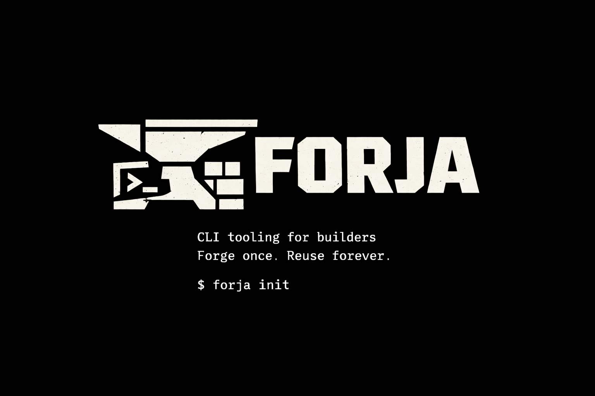

<p align="center">
  
</p>

<p align="center">
  <a href="https://github.com/dmend3z/forja/actions/workflows/ci.yml"></a>
  <a href="LICENSE"></a>
  <a href="https://www.npmjs.com/package/forja-cli"></a>
</p>

<h3 align="center">Forge once. Reuse forever.</h3>

<p align="center">
  Agent manager for <a href="https://claude.com/claude-code">Claude Code</a>. Stop configuring, start shipping.
</p>

---

Anthropic shipped [agent teams](https://code.claude.com/docs/en/agent-teams) in Claude Code — multiple AI sessions working in parallel, coordinated through a shared task list. Powerful, but a lot of setup: feature flags, per-agent prompts, team structures, workflow orchestration.

**forja gives you all of that in one command.** 25 curated agents across 5 dev phases — Research, Code, Test, Review, Deploy — plus pre-built team configs, ready to go.

> **forja** (Portuguese: *forge*)

## Quick Start

### Homebrew (macOS/Linux)

```bash
brew install dmend3z/forja/forja
forja init
```

### npm

```bash
npm install -g forja-cli
forja init
```

### Shell installer

```bash
curl -fsSL https://raw.githubusercontent.com/dmend3z/forja/main/install.sh | sh
```

That's it. All 25 agents are installed and ready to use:

```bash
forja plan "add user authentication with JWT"
# reviews your codebase, interviews you, builds a phased plan

forja execute
# runs the plan with the right agents, in the right order
```

## Two Ways to Work

### `forja plan` + `forja execute` (recommended)

Structured, multi-phase execution. When you run `forja plan`, it:

1. **Interviews you** — project type, goals, exclusions
2. **Researches your codebase** — detects stack, maps architecture
3. **Selects agents** — picks agents based on your stack (Next.js, Rust, Python, etc.)
4. **Sizes the team** — `quick-fix`, `solo-sprint`, or `full-product` based on complexity
5. **Builds phased steps** — files to create/modify, dependencies, instructions
6. **Saves the plan** — JSON + Markdown in `~/.forja/plans/`

Then `forja execute` runs the plan — agents work in order, passing context between phases.

```bash
forja plan "refactor auth to use OAuth2"
# answer a few questions, review the plan

forja execute
# agents handle research → code → test → review → deploy
```

### `forja task` (quick mode)

For simple fixes where planning is overkill:

```bash
forja task "fix the typo in the login page"
```

Add `--team` for team execution without a plan:

```bash
forja task "build user dashboard" --team full-product
```

Teams auto-configure on first use. Presets: `full-product`, `solo-sprint`, `quick-fix`, `refactor`.

## Why forja?

**Without forja** — manual setup, 10+ minutes:

```
Search for Claude Code agents → Read docs → Download individually →
Configure each one → Figure out which phase needs what → Start coding
```

**With forja** — one command, 30 seconds:

```
forja init → Start coding
```

Specialized agents for your stack, TDD workflows, security audits, and team configs — all wired up and ready.

## What You Get

| Phase | Agents | What it covers |
|-------|--------|----------------|
| **Research** | 4 | Codebase exploration, docs research, architecture planning |
| **Code** | 8 | TypeScript, Python, Go, Rust, Next.js, NestJS, database, general |
| **Test** | 4 | TDD workflow, test generation, E2E Playwright, coverage analysis |
| **Review** | 5 | Code quality, security audit, performance, PR workflow, simplification |
| **Deploy** | 3 | Git commits, PR creation, post-deploy verification |
| **+Teams** | 4 configs | Multi-agent team configurations |

Run `forja list --available` to see all agents with descriptions.

## Commands

```
forja                              # Status dashboard (or welcome if not initialized)
forja init                         # Initialize + install all agents
forja plan <task>                  # Create an implementation plan (recommended)
forja execute                      # Execute the latest plan
forja execute <plan-id>            # Execute a specific plan
forja task <task>                  # Run a task directly (quick mode)
forja task <task> --team <name>    # Run with a specific team
forja list                         # Show installed agents
forja list --available             # Show all available agents
forja search <query>               # Search agents
forja info <skill-id>              # Show agent details
forja install <skill-id>           # Install a single agent
forja uninstall <skill-id>         # Remove an agent
forja update                       # Update the registry
forja doctor                       # Verify installation health
forja phases                       # Show the 5 workflow phases
```

## Agent Teams

Run complex tasks with coordinated multi-agent teams:

| Team | Agents | Use case |
|------|--------|----------|
| **full-product** | researcher + coder + tester + reviewer + deployer | Full features |
| **solo-sprint** | coder-tester + quick-reviewer | Medium features |
| **quick-fix** | coder + deployer | Hotfixes |
| **refactor** | analyzer + refactorer + behavioral reviewer | Structural changes |

```bash
forja team preset full-product
forja task "build user dashboard" --team full-product
```

> Requires `CLAUDE_CODE_EXPERIMENTAL_AGENT_TEAMS=1` in Claude Code settings.

## How It Works

```
~/.forja/
├── registry/     # Cloned agent registry (or symlink to local)
├── config.json   # Settings
└── state.json    # Installed agent IDs

~/.claude/agents/
├── forja--research--codebase--explorer--researcher.md  -> registry
├── forja--test--tdd--workflow--tdd-guide.md            -> registry
└── ...
```

`forja init` clones the agent registry and symlinks agents into `~/.claude/agents/`. Claude Code picks them up automatically — no restart needed. The `forja--` prefix prevents name collisions.

## Profiles

Control model assignments per phase:

| Profile | Thinking (Research, Review) | Execution (Code, Test, Deploy) |
|---------|----------------------------|-------------------------------|
| **fast** | sonnet | sonnet |
| **balanced** (default) | opus | sonnet |
| **max** | opus | opus |

## Documentation

| Guide | Description |
|-------|-------------|
| [Architecture](docs/ARCHITECTURE.md) | System design and data flow |
| [Agent Authoring](docs/SKILL-AUTHORING.md) | Create and publish agents |
| [Teams](docs/TEAMS.md) | Multi-agent team configs |
| [Contributing](docs/CONTRIBUTING.md) | Development setup |

## Requirements

- [Claude Code](https://claude.com/claude-code)
- `git` (for registry cloning)
- `gh` CLI (optional, for PR agents)

## License

MIT
